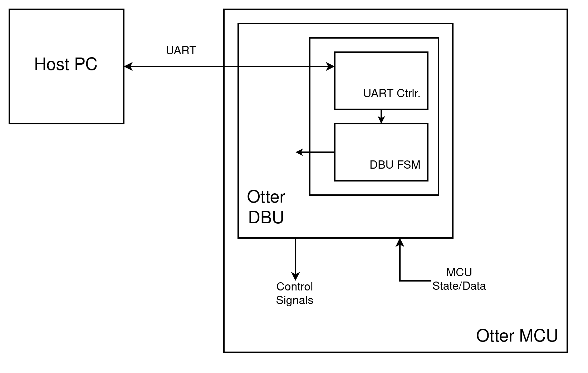

# universal-otter-debugger

## About ##

This project allows you to debug and program your Otter from a host machine.



## Features ##

- Read/write registers
- Read/write memory
- Program the Otter without re-synthesizing
- Breakpoints
- Pause/resume execution
- Configurable variables for commonly used values
- Communicates over the same micro-USB used to program the board


## Required files ##

Debugging your Otter depends on three semi-independent projects: a general RISC-V debugger module, its client, and the adapter
for the Otter. This repository houses the adapter (`otter_DBU.sv`).

```
git clone https://github.com/trmckay/universal-otter-debugger
```

The [RVDB project](https://github.com/trmckay/riscv-uart-debugger) houses everything else you need.
You will need to install the client to your machine and include the Verilog files under `module` in
your Otter project.

I recommend thoroughly reading the README there, as well as skimming the man page (`man rvdb`) once it
is installed.


## Implementing the module ##

Implementing the module for your Otter is very simple, as it uses standard Otter signals.
In general, internal MCU signals should be used when `db_active` is low and debugger signals when it is high.

More detailed instructions are included the [documentation](doc/multicycle_instructions.pdf).
